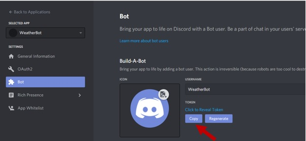
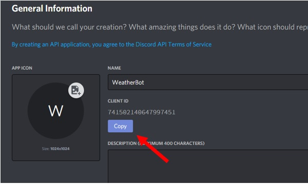
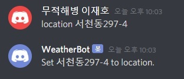
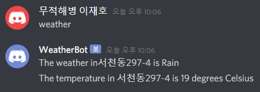
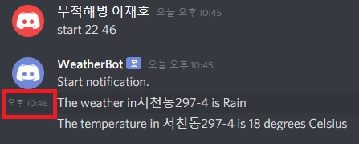
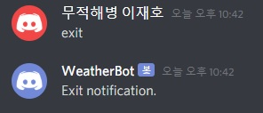

# Weather Automatic Response Chat-Bot
## Outline
Weather Automatic Response Chat-Bot.<br>
This program converts the entered address into coordinates and obtains weather information for those coordinates.<br>
Also use the Discord chat-bot to receive weather information as a Discord notification at any time you want.<br>
## Platform, Library, Packages & Modules
### Node.js
[Node.js Installation Manual](https://nodejs.org/en/)
```
node -v
```
```
npm -v
```
Install Node.js for receive various modules & packages using npm.<br>
You need to check 'node.js' and 'npm' is installed correctly using the above command.<br>
If the version is displayed, it is installed correctly.<br>

### Axios
```
npm install axios
```
Install Axios for make HTTP communication.
### Discord.js
```
npm install discord.js
```
Install Discord.js for allows interacting with the Discord API 
### Dotenv
```
npm install dotenv
```
Install Dotenv for using the API key as an environment variable.
### Node-schedule
```
npm install node-schedule 
```
Instal Node-schedule for processing a task repeatedly at a specific time.
## Open API
### Open Weather
[Open Weather](https://openweathermap.org/api)<br>
Access the link above and get the api key for Current Weather Data.<br>
### Discord bot
[Discord Bot](https://discordapp.com/developers/applications)<br>
1. Access the link above and create new application.<br><br>
<br>
2. Get the chat-bot api key.<br><br>
<br>
### Kakao Geocoding
[Kakao Geocoding](https://developers.kakao.com/product/map)<br>
Access the link above and get the api key for geocoding.<br>

## How to use
1. Add a bot to the Discord server where you are the administrator.<br>
<br>
Copy Yout Client ID.<br>
discordapp.com/oauth2/authorize?client_id=
**Your Client ID**
&scope=bot<br>
Enter the client id value to access the link above.<br><br>
2. Run index.js using the command below<br>
```
node index.js
```
<br>
3. If the chat-bot is activated correctly,
**Logged in as Bot Name!**
will be displayed.<br><br>

4. Send a personal message to the chat-bot.<br>
- To set location, input following format 'location Address'<br><br>
<br>
- To get weather information, input following format 'weather'<br><br>
<br>
- To start notification, input following format 'start Hour Min'<br><br>
<br>
- To exit notification, input following format 'exit'<br><br>
<br>
## Additional Implementation

1. node 2. axios 3. discord.js 4. dotenv 5. node-schedule
